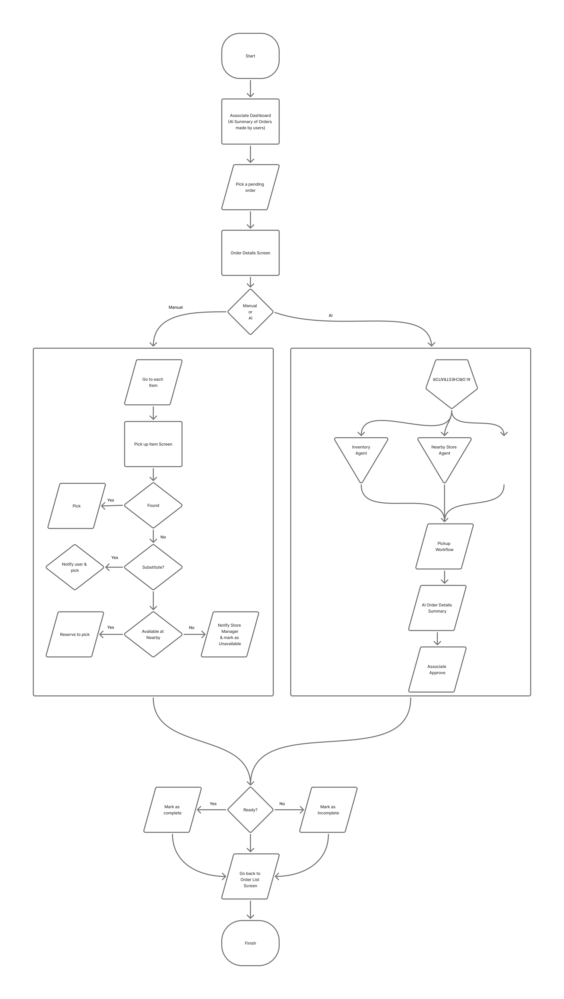

# SunCommerzAssociate

An Android application designed for store associates to manage the Buy Online, Pick Up In Store (BOPIS) fulfillment process.

## Requirements

Retail stores (for simplicity, imagine a supermarket) support a variety of sales fulfilment models, one of the most common scenarios being Buy Online, Pick Up In Store (BOPIS).  In this process, customers place orders online, which creates sales orders for the store. Store associates pick the ordered items and prepare them for collection. Customers then visit the store at their convenience to pick up their orders.

Several exception scenarios may occur during fulfilment. For example:
- The ordered product may be unavailable in the store, but a similar product may be available as a substitute.
- The product may be unavailable in the current store but available at a nearby location.

Once the picking process is completed, the information must be updated in the system so that the customer can be notified that the order is ready for pickup.
Store associates are also responsible for notifying store managers when shelves are empty or nearing depletion.

**Develop a mobile application for store associates responsible for picking products for customer orders.**

Bring an AI perspective to this use case and propose an application design. Consider the technical capabilities the application should provide. Focus on engineering the solution rather than functional completeness. Explain the high-level architecture, key components, and AI-related considerations for the solution.

## Flow Diagram

The following diagram illustrates the improvised final flow of the application:

## Screen Flow

---
*Note: This is an initial version of the README. Final content will be added upon project completion.*
